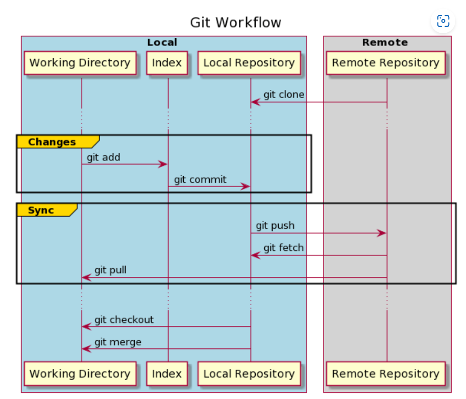

# ***Git Tutorials***

- ## *Git Config*

    - For setting configuration variables like name, email, etc.
    - Used to configure git.

    - Supports different levels - `system, global, local, worktree & file`
    - `system level` - Applies to all users on the system. Present in `/etc/gitconfig` 
    - `global level` - Applies to current user across all repositories. Present in `~/.gitconfig`
    - `local level` - Applies to specific repository only. Present in `.git/config` file of local repo.
    - eg. git config --[system|global|local] user.name " "
    - git first checks local, then goes upto system (if value not present) ==> `local overrides global overrides system`

- ## *Git Repository*
  - ### Creating a repository
    1. git init - initializes new repository
    2. git clone - clone an existing repository

- ## *Git Workflow*
  - Local repo contains 3 different trees maintained by GIT
  
     1. Working directory - holds actual version of files
     2. Index - staging area; done using ` git add ` command. Index files are tracked by git for changes
     3. Local repository - save changes to local repo using ` git commit ` command
  - Repository ***HEAD*** always points to the last commit made
  - If there is a remote repo also, synchronize them using ` git push ` command
  - ***Git Workflow***
  

- ## ***Making Changes***
  - ### *git status*
    1.  shows current changes
    2.  If a new file is created, changes are reflected only in the working tree (directory)
   
  - ### *git add*
    1. Tracks the files added for any changes
   
    2. Moves files to staging (index) area  
   
    3. `git stage` command can also be used
   
   - ### *git restore & gitignore*
      1. ***git restore*** - removes file from index (staging area) temporarily and stops tracking them. eg. `git restore -S myfile.txt`
   
      2. ***gitignore*** - include files in gitignore to permanently exclude them from tracking
   
   - ### *git commit*
      1. Saves the changes
      > commit is a `Git Object` which is like a snapshot of our repo.
      2. `git commit -m "Initial commit`